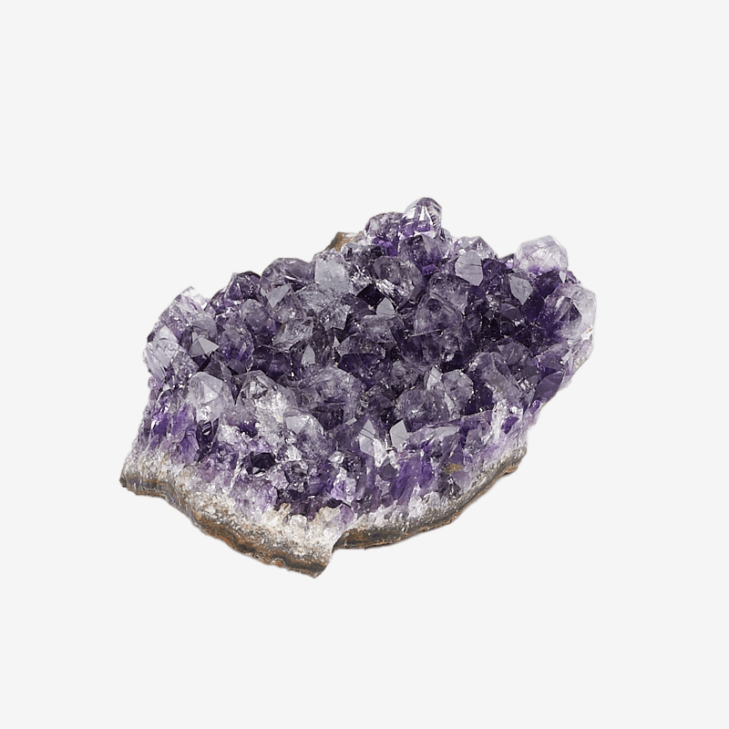
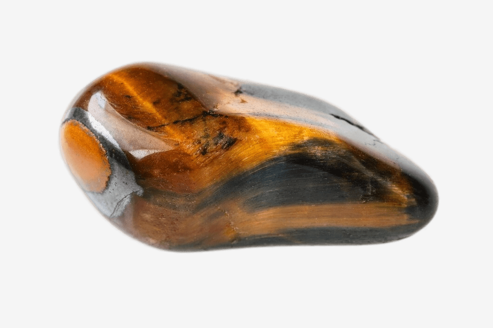

# High quality photos of minerals
Free of charge high quality photos of minerals

This repository contains a collection of mineral photos in the root directory. The images are numbered from `img001.png` to `img01.png`. 

## Preview

Here's a preview of some of the mineral photos:

| Mineral Photo     | Description |
|-------------------|-------------|
|  | Amethyst |
|  | Aventurine |
|  | Onyx |
|  | Opal |
|  | Petrified Wood |
|  | Tiger's Eye |
|  | Hawk's Eye |
|  | Bauxite |
|  | Magnetite |
|  | Limonite |
|  | Earrings' Petrified Wood |

Feel free to explore the repository to see all the mineral photos!

You can download the ZIP file of the repository by clicking on the **Code** button and selecting **Download ZIP**.

## License

THE PROJECT AND ITS CONTENT IS LICENSED UNDER THE "Do What The Fuck You Want To Public License (WTFPL)"

## Contributing

If you'd like to contribute to this collection by adding more mineral photos, feel free to submit a pull request. Make sure to follow the repository's guidelines for contributing.

## Issues

If you encounter any issues with the mineral photos or have any suggestions for improvement, please open an issue in the repository. We appreciate your feedback!

---

Enjoy exploring the mineral photos!
